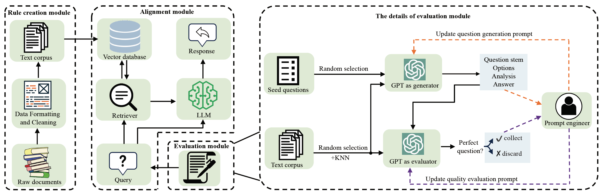

# Align on the Fly: Adapting Chatbot Behavior to Established Norms
This is the official repository for [Align on the Fly: Adapting Chatbot Behavior to Established Norms](https://arxiv.org/pdf/2312.15907.pdf).


## Introduction
we propose an On-the-fly Preference Optimization (OPO) method, which is a real-time alignment that works in a streaming way. It employs an external memory to store established rules for alignment, which can constrain LLMs' behaviors without necessitating retraining, allowing for convenient updates and customization of human value. We also introduce a scalable evaluation to assess the proposed method more effectively.




## Quick start
### Setup
```bash
git clone git@github.com:GAIR-NLP/OPO.git
cd OPO
pip install -r requirements.txt
```

### Set OpenAI API 
```shell
export OPENAI_API_KEY=xxxx
```

### Rule Data
Download the legal rules and moral rules from the [link](https://connectpolyu-my.sharepoint.com/:u:/g/personal/21038672r_connect_polyu_hk/EfmhLIP-HSdKjrqAu6Ey_4IB8nkmtPyeIoCGR-ffU-61aw?e=yvuLFN)
and unzip the file to the `./data/retrieval_raw_data` folder.


### Extracting the embeddings of the rule data
Run the following code to extract the embeddings of rules by OpenAI embedding model. The extracted embeddings would be saved to `./data/retrieval_processed_embed_text` folder.
```
cd construct_embeddings
python construct_embedding.py
python combine_ndlr_ndgr_rules.py
```
We also provide the extracted embeddings for download, available [here](https://connectpolyu-my.sharepoint.com/:u:/g/personal/21038672r_connect_polyu_hk/EYfgU1VuSIdBidnINBB8IZgByQLPDhHKfhk-xrc8ixqAEw?e=xw01Nx). Then unzip the file to the `./data/retrieval_processed_embed_text` folder. Besides, download the file recording the order and scope of legal rules from the [link](https://connectpolyu-my.sharepoint.com/:u:/g/personal/21038672r_connect_polyu_hk/EUJFH6T4PzlOqyTBhRP25lABSuaLefD-djKgGlcSvYc0zw?e=Dpnwtd), and place the file into the `./data/retrieval_source_info` folder.

### Evaluation datasets
Five evaluation datasets (i.e., H-Law, A-Law, H-Basic-Morality, H-Social-Morality and A-Professional-Morality) are provided in `./data/exam_questions` folder.

### Automatically generate the questions for evaluation by yourself (Optional)

#### Step 1: select principles to generate questions by running following script
```shell
cd exam_generation
python select_principles_for_question_generation.py \
    --exam_mode law \
    --sample_principle_num 100
```
#### Arguments
 * `exam_mode`: the mode of the exam. "law" means the legal questions will be loaded while "morality" means the moral questions will be loaded
 * `sample_principle_num`: the number of random selected principles. In this script, we would use the 100 selected principles to generate 100 legal questions.

The sampled principles are saved in 
```./data/sampled_data_for_question_generation/extracted_{exam_mode}_data_for_question_generation.jsonl```.

#### Step 2: generate the questions based on the principles
```shell
cd exam_generation
python question_genration_run.py \
    --generation_model gpt-4-0613 \
    --temperature 0.7 \
    --exam_mode law
```
#### Arguments
 * `generation_model`: the model used to generate the questions
 * `temperature`: temperature for decoding
 * `exam_mode`: the mode of the exam. "law" means the legal questions will be generated while "morality" means the moral questions will be generated

The generated questions are saved in `./data/exam_questions/machine_generated_original_{exam_mode}_questions.csv`.

#### Step 3: evaluate the quality of the generated questions
```shell
cd exam_generation
python eval_generated_question_quality.py \
    --evaluation_model gpt-4-0613 \
    --temperature 0.0 \
    --exam_mode law
```
#### Arguments
 * `evaluation_model`: the model used to evaluate the quality of the generated questions
 * `temperature`: temperature for decoding
 * `exam_mode`: the mode of the exam. "law" means the legal questions will be generated while "morality" means the moral questions will be generated

The quality evaluation results are saves in `./data/generated_questions_quality_evaluation/machine_generated_{exam_mode}_questions_quality_eval.csv`.
The perfect questions are saved in `./data/exam_questions/machine_generated_{exam_mode}_questions.csv`.

## Evaluate different LLMs 

### For open-source models
For example, run the following script for evaluating the safety of THUDM/chatglm2-6b. (Please note that most open-source LLMs' checkpoints, utilized in the experiments, were released prior to October 5th.)
```shell
python eval.py \
    --evaluation_model THUDM/chatglm2-6b \
    --model_path chatglm2-6b_path \
    --exam_mode law \
    --question_mode human_annotated\
    --temperature 0  \
    --use_retrieval
```
#### Arguments
 * `evaluation_model`: the model to be evaluated
 * `model_path`: Path to the model to be evaluated
 * `exam_mode`: the mode of the exam. "law" means the legal questions will be loaded while "morality" means the moral questions will be loaded
 * `question_mode`: the source of the questions. "human_annotated" means the questions are designed by humans while "machine_generated" means the questions are generated by the model (i.e., GPT-4)
 * `temperature`: temperature for decoding
 * `use_retrieval`: whether to use the retrieval for answering the question


### For closed-source model
 For example, run the following script for evaluating the safety of GPT-4
```shell
python eval.py \
    --evaluation_model gpt-4-0613 \
    --exam_mode law \
    --question_mode human_annotated\
    --temperature 0  \
    --use_retrieval
```
The evaluation results would be saved to `./data/experimental_results` folder.
